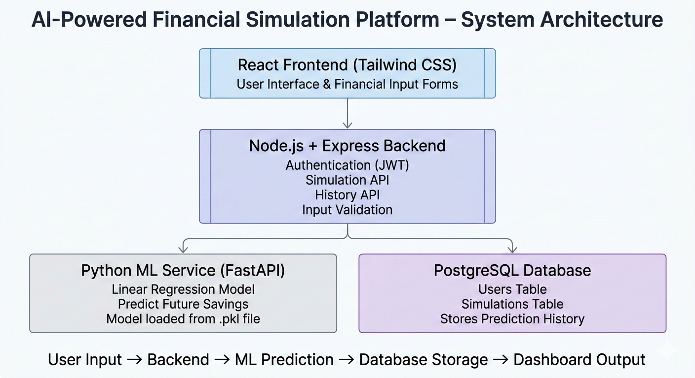

💰 Future Finance AI Simulation Platform
Team: Funk Alexa
🚀 Problem Statement

Individuals make financial decisions without understanding long-term consequences. There is no intelligent system that allows users to simulate financial scenarios and evaluate future impact before making spending decisions.

💡 Proposed Solution

We are building an AI-powered financial simulation platform that enables users to perform “what-if” analysis on spending decisions and receive predictive insights using regression-based forecasting models.

🎯 Key Features

Secure user authentication

Financial input simulation form

AI-powered savings prediction

Risk classification (Low / Medium / High)

Interactive dashboard with projections

Simulation history tracking

🤖 AI Component

We implement a regression-based financial forecasting engine:

Linear Regression → Predict future savings

Logistic Regression → Classify financial risk

Synthetic dataset generation for training

Model trained and served via Python microservice

Integrated with backend through REST API

🏗 System Architecture

Frontend (React + Tailwind)
↓
Backend (Node.js + Express)
↓
PostgreSQL Database
↓
Python ML Microservice (scikit-learn)

🔄 Application Flow

User Input → Backend API → ML Prediction Service → Database Storage → Dashboard Display

🛠 Tech Stack

Frontend: React, Tailwind CSS
Backend: Node.js, Express
Database: PostgreSQL
AI: Python, scikit-learn
Version Control: Git & GitHub

🔮 Future Scope

Personalized AI financial recommendations

Adaptive learning models

Real-time financial advisory engine

## 🏗 System Architecture

Advanced predictive analytics
